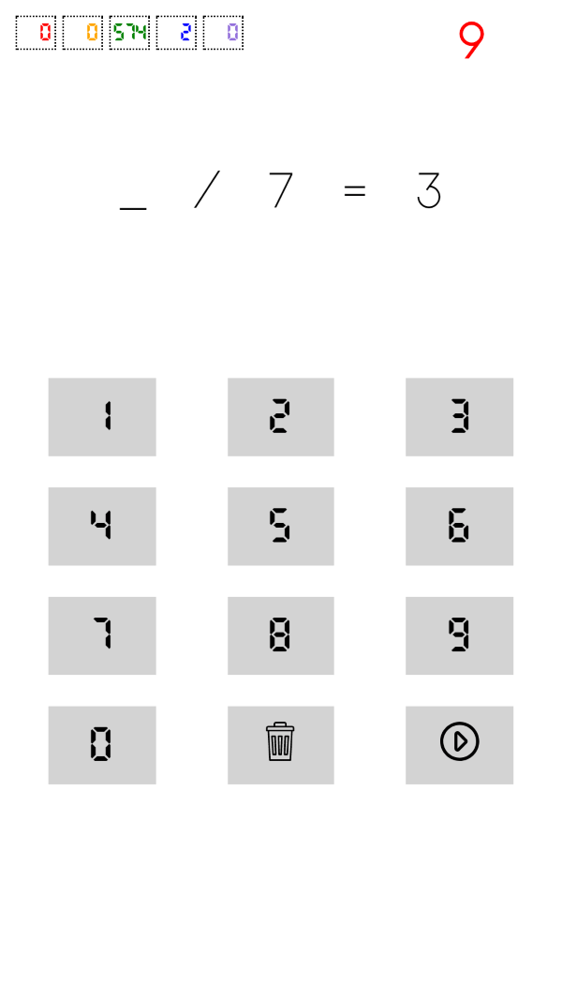

# multiply-and-divide
WebApp to practice and acquire mental speed in multiplication and division. It is a responsive PWA HTML, CSS and plain Javascript WebApp.

The webapp presents cards with a simple multiplication or division that is missing a piece of information and the user has to type the answer (with the physical keyboard or with the buttons on the screen).

It uses 5 boxes to classify the cards according to how you hit or miss, using the [Leitner System](https://en.wikipedia.org/wiki/Leitner_system).

The webapp is published in https://multiplicar-ee590.web.app

## Screenshots

